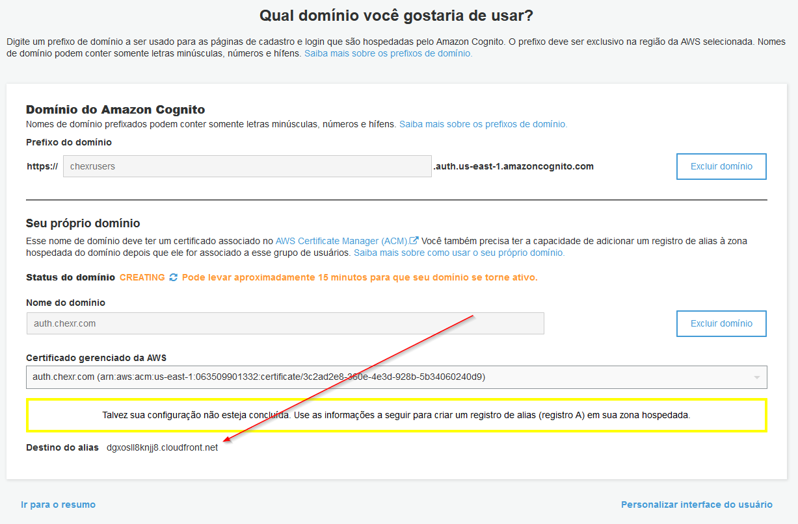

= Chexr Receipts Infrastructure

The infrastructure deployment and mantainence is fully automated using link:https://www.terraform.io/[Terraform]. 

Some manual steps are needed. Mostly they are related more to presentation than functionality.

== Cognito Custom Domain

1. Create (and validate) certificate for the custom domain link:https://us-east-1.console.aws.amazon.com/acm/home[here];
1. Go to _Cognito User Pool_, _Domain_ and  set correct domain name and select the certificate you created on previous step
1. On _Route53_ DNS service, set the correct `CNAME` alias to the user pool (defined at the bottom of the screen - see image bellow)

== API Management Custom Domain

1. Create (and validate) certificate link:https://us-east-1.console.aws.amazon.com/acm/home[here]

1. On API Gateway service, go to `Custom domain names` (usually the second link)

1. Follow this link:https://docs.aws.amazon.com/apigateway/latest/developerguide/how-to-edge-optimized-custom-domain-name.html[tutorial]

== Connecting to DocumentDB

DocumentDB only works through virtual private networks and is not directly accessible from the internet. Terraform project create a _free-tier_ EC2 machine to create a _network tunnel_ between SSH and the virtual network. The terraform project also creates the SSH key in the root directory named `tf-cherx-api-ec2`.

Just type this code in the terminal in the root directory (use the correct DocumentDB Host in env var `DOCUMENTDB_HOST` and the correct EC2 host in `EC2_HOST` env var). 

   \> DOCUMENTDB_HOST=tf-cherx-api.cluster-c9gvm17pgarr.us-east-1.docdb.amazonaws.com
   \> EC2_HOST=ec2-54-162-133-99.compute-1.amazonaws.com
   \> ssh -i tf-cherx-api-ec2 -L 27018:$DOCUMENTDB_HOST:27017 ubuntu@$EC2_HOST -N

Then you can normally connect to the cluster using port 27018 with login and password defined in terraform.

